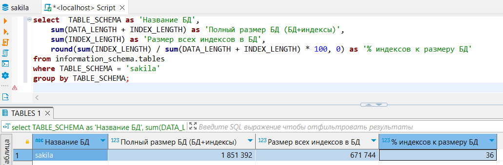

# Домашнее задание к занятию «Индексы»

### Задание 1

Напишите запрос к учебной базе данных, который вернёт процентное отношение общего размера всех индексов к общему размеру всех таблиц.

**Решение:**
```
select  TABLE_SCHEMA as 'Название БД',  
    sum(DATA_LENGTH + INDEX_LENGTH) as 'Полный размер БД (БД+индексы)', 
    sum(INDEX_LENGTH) as 'Размер всех индексов в БД', 
    round(sum(INDEX_LENGTH) / sum(DATA_LENGTH + INDEX_LENGTH) * 100, 0) as '% индексов к размеру БД'
from information_schema.tables
where TABLE_SCHEMA = 'sakila'
group by TABLE_SCHEMA;
```

<kbd></kbd>

---

### Задание 2

Выполните explain analyze следующего запроса:
```sql
select distinct concat(c.last_name, ' ', c.first_name),
       sum(p.amount) over (partition by c.customer_id, f.title)
from payment p, rental r, customer c, inventory i, film f
where date(p.payment_date) = '2005-07-30' and
      p.payment_date = r.rental_date and
      r.customer_id = c.customer_id and i.inventory_id = r.inventory_id
```
- перечислите узкие места;
- оптимизируйте запрос: внесите корректировки по использованию операторов, при необходимости добавьте индексы.

**Решение:**


