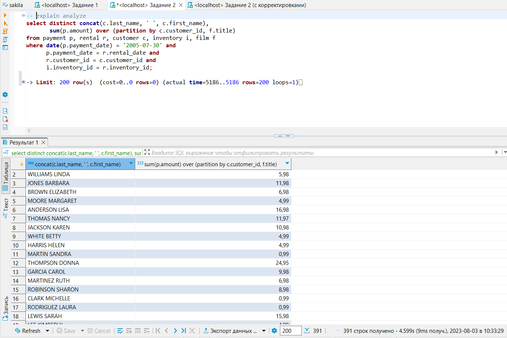

# Домашнее задание к занятию «Индексы»

### Задание 1

Напишите запрос к учебной базе данных, который вернёт процентное отношение общего размера всех индексов к общему размеру всех таблиц.

**Решение:**
```
select  TABLE_SCHEMA as 'Название БД',  
    sum(DATA_LENGTH + INDEX_LENGTH) as 'Полный размер БД (БД+индексы)', 
    sum(INDEX_LENGTH) as 'Размер всех индексов в БД', 
    round(sum(INDEX_LENGTH) / sum(DATA_LENGTH + INDEX_LENGTH) * 100, 0) as '% индексов к размеру БД'
from information_schema.tables
where TABLE_SCHEMA = 'sakila'
group by TABLE_SCHEMA;
```

<kbd></kbd>

---

### Задание 2

Выполните explain analyze следующего запроса:
```sql
select distinct concat(c.last_name, ' ', c.first_name),
       sum(p.amount) over (partition by c.customer_id, f.title)
from payment p, rental r, customer c, inventory i, film f
where date(p.payment_date) = '2005-07-30' and
      p.payment_date = r.rental_date and
      r.customer_id = c.customer_id and
      i.inventory_id = r.inventory_id
```
- перечислите узкие места;
- оптимизируйте запрос: внесите корректировки по использованию операторов, при необходимости добавьте индексы.

**Решение:**

- Запустим оператор **explain analyze** для оригинальной версии кода запроса:
```
explain analyze
select distinct concat(c.last_name, ' ', c.first_name),
       sum(p.amount) over (partition by c.customer_id, f.title)
from payment p, rental r, customer c, inventory i, film f
where date(p.payment_date) = '2005-07-30' and
      p.payment_date = r.rental_date and
      r.customer_id = c.customer_id and
      i.inventory_id = r.inventory_id;
```
- Получили следующие результаты:
```
> Limit: 200 row(s)  (cost=0..0 rows=0) (actual time=5186..5186 rows=200 loops=1)
    -> Table scan on <temporary>  (cost=2.5..2.5 rows=0) (actual time=5186..5186 rows=200 loops=1)
        -> Temporary table with deduplication  (cost=0..0 rows=0) (actual time=5186..5186 rows=391 loops=1)
            -> Window aggregate with buffering: sum(payment.amount) OVER (PARTITION BY c.customer_id,f.title )   (actual time=3353..4971 rows=642000 loops=1)
                -> Sort: c.customer_id, f.title  (actual time=3342..3434 rows=642000 loops=1)
                    -> Stream results  (cost=22.1e+6 rows=16.3e+6) (actual time=1.98..2503 rows=642000 loops=1)
                        -> Nested loop inner join  (cost=22.1e+6 rows=16.3e+6) (actual time=1.83..2123 rows=642000 loops=1)
                            -> Nested loop inner join  (cost=20.5e+6 rows=16.3e+6) (actual time=1.81..1906 rows=642000 loops=1)
                                -> Nested loop inner join  (cost=18.8e+6 rows=16.3e+6) (actual time=1.45..1637 rows=642000 loops=1)
                                    -> Inner hash join (no condition)  (cost=1.61e+6 rows=16.1e+6) (actual time=1.17..67.7 rows=634000 loops=1)
                                        -> Filter: (cast(p.payment_date as date) = '2005-07-30')  (cost=1.68 rows=16086) (actual time=0.123..9.39 rows=634 loops=1)
                                            -> Table scan on p  (cost=1.68 rows=16086) (actual time=0.0763..6.89 rows=16044 loops=1)
                                        -> Hash
                                            -> Covering index scan on f using idx_title  (cost=104 rows=1000) (actual time=0.11..0.745 rows=1000 loops=1)
                                    -> Covering index lookup on r using rental_date (rental_date=p.payment_date)  (cost=0.969 rows=1.01) (actual time=0.00157..0.0023 rows=1.01 loops=634000)
                                -> Single-row index lookup on c using PRIMARY (customer_id=r.customer_id)  (cost=0.001 rows=1) (actual time=232e-6..258e-6 rows=1 loops=642000)
                            -> Single-row covering index lookup on i using PRIMARY (inventory_id=r.inventory_id)  (cost=325e-6 rows=1) (actual time=160e-6..186e-6 rows=1 loops=642000)
```

<kbd></kbd>

- Внесем корректировки в код для оптимизации выполнения запроса:
```
select distinct concat(c.last_name, ' ', c.first_name) as 'Клиент', 
       sum(p.amount) over (partition by c.customer_id) as 'Сумма платежей'
       -- c.customer_id, f.title, p.amount 
from payment p inner join 
     rental r on p.rental_id = r.rental_id 
     inner join customer c on r.customer_id = c.customer_id
     inner join inventory i on r.inventory_id = i.inventory_id
     inner join film f on i.film_id = f.film_id 
where date(p.payment_date) = '2005-07-30';
```
- Запустим **explain analyze** для оптимизированного запроса:
```
-> Limit: 200 row(s)  (cost=0..0 rows=0) (actual time=30.8..30.9 rows=200 loops=1)
    -> Table scan on <temporary>  (cost=2.5..2.5 rows=0) (actual time=30.8..30.9 rows=200 loops=1)
        -> Temporary table with deduplication  (cost=0..0 rows=0) (actual time=30.8..30.8 rows=391 loops=1)
            -> Window aggregate with buffering: sum(payment.amount) OVER (PARTITION BY c.customer_id )   (actual time=26..30.1 rows=634 loops=1)
                -> Sort: c.customer_id  (actual time=25.9..26.1 rows=634 loops=1)
                    -> Stream results  (cost=35448 rows=16086) (actual time=0.174..25.3 rows=634 loops=1)
                        -> Nested loop inner join  (cost=35448 rows=16086) (actual time=0.166..24.6 rows=634 loops=1)
                            -> Nested loop inner join  (cost=29818 rows=16086) (actual time=0.16..22.7 rows=634 loops=1)
                                -> Nested loop inner join  (cost=24187 rows=16086) (actual time=0.154..21.1 rows=634 loops=1)
                                    -> Nested loop inner join  (cost=18557 rows=16086) (actual time=0.146..19.7 rows=634 loops=1)
                                        -> Filter: ((cast(p.payment_date as date) = '2005-07-30') and (p.rental_id is not null))  (cost=1633 rows=16086) (actual time=0.129..17.5 rows=634 loops=1)
                                            -> Table scan on p  (cost=1633 rows=16086) (actual time=0.0972..12.5 rows=16044 loops=1)
                                        -> Single-row index lookup on r using PRIMARY (rental_id=p.rental_id)  (cost=0.952 rows=1) (actual time=0.00306..0.00311 rows=1 loops=634)
                                    -> Single-row index lookup on c using PRIMARY (customer_id=r.customer_id)  (cost=0.25 rows=1) (actual time=0.00178..0.00182 rows=1 loops=634)
                                -> Single-row index lookup on i using PRIMARY (inventory_id=r.inventory_id)  (cost=0.25 rows=1) (actual time=0.00225..0.0023 rows=1 loops=634)
                            -> Single-row covering index lookup on f using PRIMARY (film_id=i.film_id)  (cost=0.25 rows=1) (actual time=0.00238..0.00244 rows=1 loops=634)
```

<kbd></kbd>
